<p align="center">
  <a href="https://discord.gg/hmmM89nCdX">
    
  </a>
  &nbsp;
  
  &nbsp;
  
  &nbsp;
  
</p>

<p align="center">
  
</p>

---

## ◈ About

```
  ┌─────────────────────────────────────────────────────────┐
  │  I build systems — not just apps.                       │
  │                                                         │
  │  My work sits at the intersection of structure,         │
  │  UX and scalability. I'm drawn to OSINT tooling,        │
  │  dashboards, automation and community platforms.        │
  │                                                         │
  │  Design language:  clean · dark · futuristic · nordic   │
  └─────────────────────────────────────────────────────────┘
```

---

## ◈ Stack

<p align="left">
  
</p>
<p align="left">
  
</p>

---

## ◈ Activity


---

## ◈ Stats

<table width="100%" border="0" cellspacing="0" cellpadding="0">
  <tr>
    <td width="50%" align="center">
      
    </td>
    <td width="50%" align="center">
      
    </td>
  </tr>
  <tr>
    <td width="100%" align="center" colspan="2">
      
    </td>
  </tr>
</table>

---

## ◈ Trophies

<p align="center">
  
</p>

---


